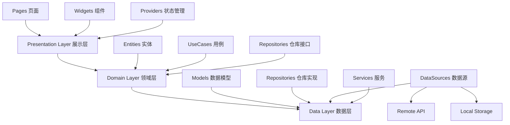

# 周期提醒前端开发规范 - Flutter

# 📱 TimeKeeper 前端开发规范

## 📋 目录

1. [项目概述](#1-项目概述)
2. [技术栈与架构](#2-技术栈与架构)
3. [项目结构规范](#3-项目结构规范)
4. [核心业务逻辑](#4-核心业务逻辑)
5. [状态管理架构](#5-状态管理架构)
6. [UI/UX 设计规范](#6-uiux-设计规范)
7. [API 集成架构](#7-api-集成架构)
8. [本地存储策略](#8-本地存储策略)
9. [推送通知架构](#9-推送通知架构)
10. [测试架构](#10-测试架构)
11. [构建与部署](#11-构建与部署)
12. [性能优化策略](#12-性能优化策略)
13. [代码质量工具链](#13-代码质量工具链)

---

## 1. 项目概述

**项目名称**: TimeKeeper - 周期提醒 APP 前端

**技术架构**: Flutter + Dart + Clean Architecture

**Flutter 版本**: 3.24+ | **Dart 版本**: 3.5+

### 1.1 核心特性

- 📱 **跨平台开发**: 一套代码支持 iOS/Android
- 🎨 **Material Design 3**: 现代化设计语言
- 🔄 **响应式状态管理**: Riverpod 状态管理
- 🌐 **RESTful API 集成**: 与 FastAPI 后端对接
- 💾 **轻量级存储**: Hive缓存 + SharedPreferences配置
- 🔔 **智能推送**: 本地+远程双重通知机制
- 🎯 **老年友好设计**: 大字体、高对比度、语音交互

---

## 2. 技术栈与架构

### 2.1 核心技术栈

```yaml
# 核心依赖
dependencies:
  flutter_riverpod: ^2.5.1      # 状态管理
  dio: ^5.7.0                   # HTTP客户端
  retrofit: ^4.4.1              # API代码生成
  hive: ^2.2.3                  # 本地缓存
  flutter_local_notifications: ^17.2.3  # 本地通知
  
# 开发工具
dev_dependencies:
  build_runner: ^2.4.13         # 代码生成
  flutter_lints: ^5.0.0         # 代码检查
  very_good_analysis: ^6.0.0    # 高级代码分析
```

### 2.2 整体架构图

### 2.1 核心技术栈

```yaml
# 核心依赖
dependencies:
  flutter_riverpod: ^2.5.1      # 状态管理
  dio: ^5.7.0                   # HTTP客户端
  retrofit: ^4.4.1              # API代码生成
  hive: ^2.2.3                  # 本地缓存
  flutter_local_notifications: ^17.2.3  # 本地通知
  go_router: ^14.2.7            # 声明式路由
  cached_network_image: ^3.4.1  # 图片缓存
  flutter_secure_storage: ^9.2.2 # 安全存储
  intl: ^0.19.0                 # 国际化
  
# 开发工具
dev_dependencies:
  build_runner: ^2.4.13         # 代码生成
  flutter_lints: ^5.0.0         # 代码检查
  very_good_analysis: ^6.0.0    # 高级代码分析
  mockito: ^5.4.4               # 测试模拟
  integration_test: ^1.0.0      # 集成测试
  
# 平台特定
dependencies:
  # iOS特定
  cupertino_icons: ^1.0.8       # iOS图标
  
  # Android特定  
  android_alarm_manager_plus: ^4.0.3  # Android后台任务
```

### 2.1.1 完整的pubspec.yaml配置

```yaml
name: timekeeper_flutter
description: "周期提醒应用 - 基于Flutter的跨平台解决方案"
version: 1.0.0+1

environment:
  sdk: '>=3.5.0 <4.0.0'
  flutter: ">=3.24.0"

dependencies:
  flutter:
    sdk: flutter
  flutter_localizations:
    sdk: flutter
    
  # 状态管理
  flutter_riverpod: ^2.5.1
  
  # 网络和API
  dio: ^5.7.0
  retrofit: ^4.4.1
  json_annotation: ^4.9.0
  
  # 本地存储
  hive: ^2.2.3
  hive_flutter: ^1.1.0
  shared_preferences: ^2.3.2
  flutter_secure_storage: ^9.2.2
  
  # 路由和导航
  go_router: ^14.2.7
  
  # UI和交互
  cached_network_image: ^3.4.1
  flutter_local_notifications: ^17.2.3
  permission_handler: ^11.3.1
  
  # 工具和实用程序
  intl: ^0.19.0
  connectivity_plus: ^6.0.5
  device_info_plus: ^10.1.2
  package_info_plus: ^8.0.2
  
  # 平台特定
  cupertino_icons: ^1.0.8

dev_dependencies:
  flutter_test:
    sdk: flutter
  integration_test:
    sdk: flutter
    
  # 代码生成
  build_runner: ^2.4.13
  retrofit_generator: ^8.2.0
  json_serializable: ^6.8.0
  hive_generator: ^2.0.1
  
  # 代码质量
  flutter_lints: ^5.0.0
  very_good_analysis: ^6.0.0
  
  # 测试工具
  mockito: ^5.4.4
  mocktail: ^1.0.4

flutter:
  uses-material-design: true
  generate: true  # 启用国际化代码生成
  
  assets:
    - assets/images/
    - assets/icons/
    - assets/sounds/
    
  fonts:
    - family: Roboto
      fonts:
        - asset: assets/fonts/roboto/Roboto-Regular.ttf
        - asset: assets/fonts/roboto/Roboto-Bold.ttf
          weight: 700
```

### 2.2 整体架构图



### 2.3 详细目录结构

```
TimeKeeper_Flutter/
├── lib/
│   ├── main.dart                        # 应用入口点
│   ├── app/                            # 应用层配置
│   │   ├── app.dart                    # App根组件
│   │   ├── router/                     # 路由系统
│   │   │   ├── app_router.dart         # 主路由配置
│   │   │   ├── route_paths.dart        # 路由路径常量
│   │   │   └── router_guards.dart      # 路由守卫
│   │   ├── theme/                      # 主题系统
│   │   │   ├── app_theme.dart          # 主题配置
│   │   │   ├── app_colors.dart         # 颜色定义
│   │   │   ├── app_text_styles.dart    # 文字样式
│   │   │   └── app_dimensions.dart     # 尺寸规范
│   │   └── constants/                  # 全局常量
│   │       ├── app_constants.dart      # 应用常量
│   │       ├── api_endpoints.dart      # API端点
│   │       └── asset_paths.dart        # 资源路径
│   ├── core/                          # 核心基础设施
│   │   ├── api/                       # API基础设施
│   │   │   ├── api_client.dart        # HTTP客户端配置
│   │   │   ├── interceptors/          # 请求拦截器
│   │   │   └── error_handler.dart     # 错误处理
│   │   ├── storage/                   # 存储基础设施
│   │   │   ├── hive_service.dart      # Hive缓存服务
│   │   │   ├── preferences_service.dart # SharedPreferences
│   │   │   └── secure_storage.dart    # 安全存储
│   │   ├── utils/                     # 工具类
│   │   │   ├── date_utils.dart        # 日期工具
│   │   │   ├── validation_utils.dart  # 验证工具
│   │   │   └── responsive_utils.dart  # 响应式工具
│   │   ├── extensions/                # 扩展方法
│   │   │   ├── datetime_extensions.dart
│   │   │   ├── string_extensions.dart
│   │   │   └── context_extensions.dart
│   │   └── exceptions/                # 异常处理
│   │       ├── app_exception.dart     # 应用异常基类
│   │       └── api_exception.dart     # API异常
│   ├── data/                          # 数据层
│   │   ├── models/                    # 数据模型
│   │   │   ├── reminder.dart          # 提醒模型
│   │   │   ├── user.dart              # 用户模型
│   │   │   └── api_response.dart      # API响应模型
│   │   ├── repositories/              # 仓库实现
│   │   │   ├── reminder_repository_impl.dart
│   │   │   ├── user_repository_impl.dart
│   │   │   └── auth_repository_impl.dart
│   │   ├── datasources/               # 数据源
│   │   │   ├── remote/                # 远程数据源
│   │   │   │   ├── reminder_api.dart
│   │   │   │   ├── user_api.dart
│   │   │   │   └── auth_api.dart
│   │   │   └── local/                 # 本地数据源
│   │   │       ├── reminder_local_ds.dart
│   │   │       ├── user_local_ds.dart
│   │   │       └── cache_local_ds.dart
│   │   └── services/                  # 数据服务
│   │       ├── sync_service.dart      # 数据同步
│   │       ├── backup_service.dart    # 备份服务
│   │       └── encryption_service.dart # 加密服务
│   ├── domain/                        # 领域层
│   │   ├── entities/                  # 业务实体
│   │   │   ├── reminder_entity.dart
│   │   │   ├── user_entity.dart
│   │   │   └── recurrence_pattern.dart
│   │   ├── usecases/                  # 用例
│   │   │   ├── reminder/              # 提醒相关用例
│   │   │   │   ├── get_reminders.dart
│   │   │   │   ├── create_reminder.dart
│   │   │   │   ├── update_reminder.dart
│   │   │   │   └── delete_reminder.dart
│   │   │   ├── auth/                  # 认证相关用例
│   │   │   │   ├── login.dart
│   │   │   │   ├── register.dart
│   │   │   │   └── logout.dart
│   │   │   └── base_usecase.dart      # 用例基类
│   │   └── repositories/              # 仓库接口
│   │       ├── reminder_repository.dart
│   │       ├── user_repository.dart
│   │       └── auth_repository.dart
│   ├── presentation/                  # 展示层
│   │   ├── pages/                     # 页面
│   │   │   ├── splash/                # 启动页
│   │   │   │   ├── splash_page.dart
│   │   │   │   └── splash_controller.dart
│   │   │   ├── auth/                  # 认证页面
│   │   │   │   ├── login_page.dart
│   │   │   │   ├── register_page.dart
│   │   │   │   └── controllers/
│   │   │   ├── home/                  # 首页
│   │   │   │   ├── home_page.dart
│   │   │   │   ├── home_controller.dart
│   │   │   │   └── widgets/
│   │   │   ├── reminders/             # 提醒页面
│   │   │   │   ├── reminder_list_page.dart
│   │   │   │   ├── add_reminder_page.dart
│   │   │   │   ├── edit_reminder_page.dart
│   │   │   │   ├── controllers/
│   │   │   │   └── widgets/
│   │   │   └── settings/              # 设置页面
│   │   │       ├── settings_page.dart
│   │   │       ├── profile_page.dart
│   │   │       └── controllers/
│   │   ├── widgets/                   # 通用组件
│   │   │   ├── common/                # 通用组件
│   │   │   │   ├── app_button.dart
│   │   │   │   ├── app_text_field.dart
│   │   │   │   ├── loading_widget.dart
│   │   │   │   └── error_widget.dart
│   │   │   └── reminder/              # 提醒相关组件
│   │   │       ├── reminder_tile.dart
│   │   │       ├── reminder_card.dart
│   │   │       └── recurrence_picker.dart
│   │   └── providers/                 # 状态提供者
│   │       ├── providers.dart         # 统一导出
│   │       ├── core_providers.dart    # 核心服务提供者
│   │       ├── auth_providers.dart    # 认证状态
│   │       ├── reminder_providers.dart # 提醒状态
│   │       └── ui_providers.dart      # UI状态
│   └── shared/                        # 共享资源
│       ├── widgets/                   # 共享组件
│       │   ├── dialogs/               # 对话框
│       │   ├── bottom_sheets/         # 底部弹窗
│       │   └── indicators/            # 指示器
│       ├── utils/                     # 共享工具
│       │   ├── formatters.dart        # 格式化工具
│       │   ├── validators.dart        # 验证器
│       │   └── helpers.dart           # 帮助函数
│       └── constants/                 # 共享常量
│           ├── ui_constants.dart      # UI常量
│           └── business_constants.dart # 业务常量
├── assets/                            # 静态资源
│   ├── images/                        # 图片资源
│   │   ├── icons/                     # 图标
│   │   ├── backgrounds/               # 背景图
│   │   └── illustrations/             # 插图
│   ├── fonts/                         # 字体资源
│   │   └── roboto/                    # Roboto字体
│   └── sounds/                        # 音频资源
│       └── notification/              # 通知音效
└── test/                              # 测试文件
    ├── unit/                          # 单元测试
    │   ├── data/                      # 数据层测试
    │   ├── domain/                    # 领域层测试
    │   └── presentation/              # 展示层测试
    ├── widget/                        # 组件测试
    │   └── widgets/                   # 组件测试文件
    └── integration/                   # 集成测试
        └── flows/                     # 用户流程测试
```

---

## 3. 项目结构规范

### 3.1 Clean Architecture 分层原则

```
┌─────────────────────────────────────┐
│        Presentation Layer           │
│  ┌─────┐ ┌─────┐ ┌─────────────┐   │
│  │Pages│ │Widgets│ │State Mgmt  │   │
│  └─────┘ └─────┘ └─────────────┘   │
└─────────────────────────────────────┘
                  ↓ 依赖
┌─────────────────────────────────────┐
│         Domain Layer                │
│  ┌─────────┐ ┌─────────┐ ┌────────┐│
│  │Entities │ │UseCases │ │Repos   ││
│  │(Business│ │(Business│ │(Abstract)││
│  │ Objects)│ │  Logic) │ │        ││
│  └─────────┘ └─────────┘ └────────┘│
└─────────────────────────────────────┘
                  ↓ 依赖
┌─────────────────────────────────────┐
│          Data Layer                 │
│  ┌──────┐ ┌──────────┐ ┌──────────┐│
│  │Models│ │Repository│ │DataSource││
│  │(DTOs)│ │ (Impl)   │ │(API/DB)  ││
│  └──────┘ └──────────┘ └──────────┘│
└─────────────────────────────────────┘
```

### 3.2 依赖注入架构

```dart
// 伪代码：Provider依赖关系图
CoreProviders {
  apiClientProvider -> DioClient
  localStorageProvider -> HiveService
  connectivityProvider -> ConnectivityService
}
    ↓
DataProviders {
  reminderRemoteDataSourceProvider -> ReminderApi
  reminderLocalDataSourceProvider -> ReminderLocalDS
  reminderRepositoryProvider -> ReminderRepositoryImpl
}
    ↓
DomainProviders {
  getReminderUseCaseProvider -> GetRemindersUseCase
  createReminderUseCaseProvider -> CreateReminderUseCase
}
    ↓
PresentationProviders {
  reminderListProvider -> ReminderListNotifier
  addReminderProvider -> AddReminderNotifier
}
```

### 3.3 文件命名约定

```dart
// 命名规范示例
文件命名: snake_case
├── reminder_list_page.dart           // 页面
├── reminder_repository_impl.dart     // 仓库实现
├── get_reminders_usecase.dart        // 用例
└── reminder_list_notifier.dart       // 状态管理器

类命名: PascalCase
├── ReminderListPage                  // 页面类
├── ReminderRepositoryImpl            // 仓库实现类
├── GetRemindersUseCase              // 用例类
└── ReminderListNotifier             // 状态管理器类

变量/函数: camelCase
├── getUserReminders()               // 函数
├── selectedDate                     // 变量
└── isLoading                       // 布尔变量

常量: lowerCamelCase
├── defaultPadding                   // 常量
├── apiTimeout                       // 超时常量
└── maxRetryCount                   // 重试次数
```

---

## 4. 核心业务逻辑

### 4.1 提醒数据模型

```dart
// 伪代码：核心数据结构
class Reminder {
  final int? id;
  final int userId;
  final String title;
  final String? description;
  final ReminderCategory category;        // 分类枚举
  final RecurrenceType recurrenceType;    // 周期类型
  final RecurrenceConfig recurrenceConfig; // 周期配置
  final DateTime? nextRemindTime;         // 下次提醒时间
  final bool isActive;
  final DateTime createdAt;
  
  // 关键方法
  Reminder copyWith({...}) => /* 克隆对象，支持部分更新 */;
  DateTime? calculateNextRemind() => /* 计算下次提醒时间 */;
  bool shouldRemindAt(DateTime time) => /* 判断是否应该在指定时间提醒 */;
}

// 周期类型枚举
enum RecurrenceType {
  once,     // 仅一次
  daily,    // 每天
  weekly,   // 每周
  monthly,  // 每月
  yearly,   // 每年
  custom    // 自定义
}

// 提醒分类
enum ReminderCategory {
  personal,  // 个人
  work,      // 工作
  health,    // 健康
  finance,   // 财务
  social,    // 社交
  daily      // 日常
}
```

### 4.2 周期计算核心算法

```dart
// 伪代码：周期提醒时间计算引擎
class RecurrenceCalculator {
  
  /// 计算下次提醒时间
  static DateTime? calculateNextRemindTime(
    DateTime baseTime,
    RecurrenceType type,
    RecurrenceConfig config
  ) {
    switch (type) {
      case daily:
        return _calculateDailyNext(baseTime, config.interval);
      case weekly:
        return _calculateWeeklyNext(baseTime, config.weekdays);
      case monthly:
        return _calculateMonthlyNext(baseTime, config.dayOfMonth);
      case yearly:
        return _calculateYearlyNext(baseTime, config.monthAndDay);
      case custom:
        return _calculateCustomNext(baseTime, config.customPattern);
    }
  }
  
  /// 智能周期模式识别算法
  static RecurrencePattern detectPattern(List<DateTime> history) {
    // 1. 计算历史间隔
    intervals = calculateIntervals(history);
    
    // 2. 分析间隔模式
    if (isConsistentDaily(intervals)) {
      return DailyPattern(interval: getCommonInterval(intervals));
    }
    
    if (isWeeklyPattern(intervals)) {
      return WeeklyPattern(weekdays: detectWeekdays(history));
    }
    
    if (isMonthlyPattern(intervals)) {
      return MonthlyPattern(dayOfMonth: detectMonthDay(history));
    }
    
    // 3. 复杂模式分析
    return CustomPattern(pattern: analyzeComplexPattern(intervals));
  }
  
  /// 提醒触发判断逻辑
  static bool shouldTriggerReminder(
    Reminder reminder, 
    DateTime currentTime
  ) {
    // 检查基础条件
    if (!reminder.isActive || reminder.nextRemindTime == null) {
      return false;
    }
    
    // 检查时间匹配（允许5分钟误差）
    timeDifference = currentTime.difference(reminder.nextRemindTime!).inMinutes.abs();
    if (timeDifference <= 5) {
      return true;
    }
    
    return false;
  }
}
```

### 4.3 本地通知调度算法

```dart
// 伪代码：通知调度引擎
class NotificationScheduler {
  
  /// 批量调度提醒通知
  static Future<void> scheduleAllReminders(List<Reminder> reminders) async {
    // 1. 清理过期的通知
    await _cancelExpiredNotifications();
    
    // 2. 按优先级排序
    sortedReminders = _sortByPriority(reminders);
    
    // 3. 批量调度（iOS限制64个，Android无限制）
    await _batchScheduleNotifications(sortedReminders);
    
    // 4. 设置下次批量更新时间
    await _scheduleNextBatchUpdate();
  }
  
  /// 智能通知时间优化
  static DateTime optimizeNotificationTime(
    DateTime originalTime, 
    UserPreferences preferences
  ) {
    // 考虑用户习惯
    if (preferences.quietHours.contains(originalTime.hour)) {
      return _adjustToNearestActiveHour(originalTime, preferences);
    }
    
    // 考虑系统电池优化
    if (_isBatteryOptimizationActive()) {
      return _adjustForBatteryOptimization(originalTime);
    }
    
    return originalTime;
  }
}
```

---

## 5. 状态管理架构

### 5.1 Riverpod 状态管理层次结构

```dart
// 状态管理架构图
Provider分层架构 {
  ┌─────────────────────────────────────┐
  │         UI State Providers          │
  │  ┌─────────────┐ ┌─────────────────┐│
  │  │Page State   │ │Theme/Locale     ││
  │  │(loading,err)│ │(UI preferences) ││  
  │  └─────────────┘ └─────────────────┘│
  └─────────────────────────────────────┘
                   ↓ 依赖
  ┌─────────────────────────────────────┐
  │       Business Logic Providers      │
  │  ┌─────────────┐ ┌─────────────────┐│
  │  │Reminder     │ │Auth State       ││
  │  │Management   │ │Management       ││
  │  └─────────────┘ └─────────────────┘│
  └─────────────────────────────────────┘
                   ↓ 依赖
  ┌─────────────────────────────────────┐
  │        Data Access Providers        │
  │  ┌─────────────┐ ┌─────────────────┐│
  │  │Repository   │ │Cache Management ││
  │  │Providers    │ │Providers        ││
  │  └─────────────┘ └─────────────────┘│
  └─────────────────────────────────────┘
                   ↓ 依赖
  ┌─────────────────────────────────────┐
  │        Core Service Providers       │
  │  ┌─────────────┐ ┌─────────────────┐│
  │  │HTTP Client  │ │Local Storage    ││
  │  │Provider     │ │Provider         ││
  │  └─────────────┘ └─────────────────┘│
  └─────────────────────────────────────┘
}
```

### 5.2 核心状态管理器伪代码

```dart
// 伪代码：提醒列表状态管理器
class ReminderListNotifier extends AsyncNotifier<List<Reminder>> {
  
  @override
  Future<List<Reminder>> build() async {
    // Step 1: 获取依赖的仓库
    final repository = [ref.read](http://ref.read)(reminderRepositoryProvider);
    
    // Step 2: 获取提醒列表（离线优先）
    final reminders = await repository.getAllReminders();
    
    // Step 3: 启动后台同步
    _startBackgroundSync();
    
    return reminders;
  }
  
  /// 添加新提醒
  Future<void> addReminder(Reminder reminder) async {
    // Step 1: 乐观更新UI
    final currentState = state.valueOrNull ?? [];
    state = [AsyncValue.data](http://AsyncValue.data)([...currentState, reminder]);
    
    try {
      // Step 2: 保存到仓库
      final repository = [ref.read](http://ref.read)(reminderRepositoryProvider);
      final savedReminder = await repository.createReminder(reminder);
      
      // Step 3: 调度通知
      await NotificationScheduler.scheduleReminderNotification(savedReminder);
      
      // Step 4: 更新状态
      final updatedList = [currentState.map](http://currentState.map)((r) => 
        [r.id](http://r.id) == null ? savedReminder : r
      ).toList();
      state = [AsyncValue.data](http://AsyncValue.data)(updatedList);
      
    } catch (error) {
      // 回滚乐观更新
      state = [AsyncValue.data](http://AsyncValue.data)(currentState);
      rethrow;
    }
  }
  
  /// 更新提醒
  Future<void> updateReminder(Reminder reminder) async {
    final currentState = state.valueOrNull ?? [];
    final updatedList = [currentState.map](http://currentState.map)((r) => 
      [r.id](http://r.id) == [reminder.id](http://reminder.id) ? reminder : r
    ).toList();
    
    // 乐观更新
    state = [AsyncValue.data](http://AsyncValue.data)(updatedList);
    
    try {
      final repository = [ref.read](http://ref.read)(reminderRepositoryProvider);
      await repository.updateReminder(reminder);
      
      // 重新调度通知
      await NotificationScheduler.rescheduleReminder(reminder);
      
    } catch (error) {
      // 回滚状态
      state = [AsyncValue.data](http://AsyncValue.data)(currentState);
      rethrow;
    }
  }
  
  /// 删除提醒
  Future<void> deleteReminder(int reminderId) async {
    final currentState = state.valueOrNull ?? [];
    final updatedList = currentState.where((r) => [r.id](http://r.id) != reminderId).toList();
    
    // 乐观更新
    state = [AsyncValue.data](http://AsyncValue.data)(updatedList);
    
    try {
      final repository = [ref.read](http://ref.read)(reminderRepositoryProvider);
      await repository.deleteReminder(reminderId);
      
      // 取消通知
      await NotificationScheduler.cancelReminderNotification(reminderId);
      
    } catch (error) {
      // 回滚状态
      state = [AsyncValue.data](http://AsyncValue.data)(currentState);
      rethrow;
    }
  }
  
  /// 后台同步
  Future<void> _startBackgroundSync() async {
    final syncProvider = [ref.read](http://ref.read)(syncServiceProvider);
    
    // 监听网络状态变化
    ref.listen(connectivityProvider, (previous, next) async {
      if (next == ConnectivityResult.none) return;
      
      try {
        final syncResult = await syncProvider.syncReminders();
        if (syncResult.hasChanges) {
          // 刷新状态
          final repository = [ref.read](http://ref.read)(reminderRepositoryProvider);
          final updatedReminders = await repository.getAllReminders();
          state = [AsyncValue.data](http://AsyncValue.data)(updatedReminders);
        }
      } catch (error) {
        // 同步错误不影响UI显示
        debugPrint('Background sync failed: $error');
      }
    });
  }
}
```

### 5.3 状态同步策略

```dart
// 伪代码：离线优先的状态同步策略
class StateSyncStrategy {
  
  /// 三层状态同步模型
  static Future<void> syncReminders() async {
    // Layer 1: 内存状态 (立即响应)
    memoryState = StateManager.getCurrentMemoryState();
    
    // Layer 2: 本地缓存 (离线支持)
    localState = await LocalStorage.getCachedState();
    
    // Layer 3: 远程服务器 (权威数据源)
    try {
      remoteState = await RemoteAPI.getLatestState();
      
      // 冲突解决策略
      mergedState = ConflictResolver.merge(
        memory: memoryState,
        local: localState, 
        remote: remoteState
      );
      
      // 逐层更新状态
      await _updateAllLayers(mergedState);
      
    } catch (NetworkError) {
      // 网络错误：使用本地状态，标记待同步
      await _markForLaterSync(localState);
    }
  }
  
  /// 冲突解决算法
  static ConflictResolution resolveConflicts(
    LocalChange local, 
    RemoteChange remote
  ) {
    // 时间戳优先策略
    if (local.timestamp > remote.timestamp) {
      return ConflictResolution.preferLocal(local);
    }
    
    // 用户操作优先策略
    if (local.isUserInitiated && !remote.isUserInitiated) {
      return ConflictResolution.preferLocal(local);
    }
    
    // 默认：服务器权威
    return ConflictResolution.preferRemote(remote);
  }
}
```

---

## 6. UI/UX 设计规范

### 6.1 Material Design 3 主题架构

```dart
// 设计系统架构
DesignSystem {
  ┌──────────────────────────────────┐
  │           Color Palette           │
  │  Primary: #FF6B35 (温暖橙色)      │
  │  Secondary: #4ECDC4 (清新蓝色)    │
  │  Surface: Dynamic (跟随系统)       │
  │  Error: #BA1A1A (标准错误红)      │
  └──────────────────────────────────┘
                 ↓
  ┌──────────────────────────────────┐
  │          Typography              │
  │  Display: 57/45/36px            │
  │  Headline: 32/28/24px           │  
  │  Title: 22/16/14px              │
  │  Body: 16/14px (老年版: 20/18px)  │
  │  Label: 14/12/11px              │
  └──────────────────────────────────┘
                 ↓
  ┌──────────────────────────────────┐
  │           Spacing                │
  │  基准: 4px 网格系统               │
  │  内边距: 16px (手机) / 24px (平板) │
  │  组件间距: 8px/12px/16px/24px     │
  │  页面边距: responsive             │
  └──────────────────────────────────┘
}
```

### 6.2 响应式设计断点

```dart
// 伪代码：响应式设计系统
class ResponsiveDesign {
  // 断点定义
  static const breakpoints = {
    mobile: 0..599,      // 手机
    tablet: 600..899,    // 平板
    desktop: 900+        // 桌面
  };
  
  /// 响应式布局计算
  static LayoutConfig calculateLayout(BuildContext context) {
    screenWidth = MediaQuery.of(context).size.width;
    
    if (screenWidth < 600) {
      return MobileLayout(
        columns: 1,
        padding: 16.0,
        cardSpacing: 8.0,
        navigationStyle: BottomNavigation
      );
    } else if (screenWidth < 900) {
      return TabletLayout(
        columns: 2,
        padding: 24.0, 
        cardSpacing: 12.0,
        navigationStyle: SideRail
      );
    } else {
      return DesktopLayout(
        columns: 3,
        padding: 32.0,
        cardSpacing: 16.0,
        navigationStyle: FullSidebar
      );
    }
  }
}
```

### 6.3 无障碍设计系统

```dart
// 伪代码：无障碍设计指导原则
class AccessibilitySystem {
  
  /// 语义化组件包装器
  static Widget makeAccessible(
    Widget child, 
    AccessibilityConfig config
  ) {
    return Semantics(
      label: config.semanticLabel,           // 屏幕阅读器标签
      hint: config.semanticHint,             // 操作提示
      button: config.isButton,               // 标记为按钮
      enabled: config.isEnabled,             // 启用状态
      excludeSemantics: config.excludeFromA11y, // 排除语义
      child: _wrapWithTooltip(child, config)
    );
  }
  
  /// 触控目标尺寸优化
  static Size optimizeTouchTarget(Size originalSize) {
    minTouchTarget = Size(44, 44);  // iOS标准
    
    return Size(
      max(originalSize.width, minTouchTarget.width),
      max(originalSize.height, minTouchTarget.height)
    );
  }
  
  /// 颜色对比度验证
  static bool validateColorContrast(Color foreground, Color background) {
    contrastRatio = calculateContrastRatio(foreground, background);
    
    // WCAG AAA标准：文本对比度 >= 7:1
    return contrastRatio >= 7.0;
  }
}
```

---

## 7. API 集成架构

### 7.1 HTTP 客户端架构

```dart
// API客户端分层架构
APIArchitecture {
  ┌─────────────────────────────────────┐
  │        Presentation Layer           │
  │         (UI调用)                    │
  └─────────────────────────────────────┘
                   ↓
  ┌─────────────────────────────────────┐
  │       Repository Layer              │
  │    (业务逻辑 + 错误处理)             │
  └─────────────────────────────────────┘
                   ↓
  ┌─────────────────────────────────────┐
  │       DataSource Layer              │
  │      (API接口定义)                  │
  └─────────────────────────────────────┘
                   ↓
  ┌─────────────────────────────────────┐
  │        HTTP Client                  │
  │   (Dio + Interceptors)              │
  └─────────────────────────────────────┘
                   ↓
  ┌─────────────────────────────────────┐
  │        Network Layer                │
  │      (实际网络请求)                  │
  └─────────────────────────────────────┘
}
```

### 7.2 API错误处理策略

```dart
// 伪代码：统一错误处理机制
class ApiErrorHandler {
  
  /// 分层错误处理策略
  static Future<T> handleApiCall<T>(Future<T> Function() apiCall) async {
    try {
      result = await apiCall();
      return result;
      
    } on DioException catch (dioError) {
      // 网络层错误处理
      return _handleNetworkError(dioError);
      
    } on ApiException catch (apiError) {  
      // 业务层错误处理
      return _handleBusinessError(apiError);
      
    } catch (unknown) {
      // 未知错误处理
      return _handleUnknownError(unknown);
    }
  }
  
  /// 智能重试策略
  static Future<T> retryWithStrategy<T>(
    Future<T> Function() operation,
    RetryConfig config
  ) async {
    for (attempt in 1..config.maxRetries) {
      try {
        return await operation();
      } catch (error) {
        
        // 判断是否应该重试
        if (!_shouldRetry(error, attempt, config)) {
          rethrow;
        }
        
        // 计算退避延迟：指数退避 + 抖动
        delay = _calculateBackoffDelay(attempt, config);
        await Future.delayed(delay);
      }
    }
    
    throw MaxRetriesExceededException();
  }
}
```

### 7.3 请求缓存策略

```dart
// 伪代码：多级缓存架构
class ApiCacheStrategy {
  
  /// 三级缓存系统
  static Future<ApiResponse<T>> getCachedResponse<T>(
    String endpoint,
    CacheConfig config
  ) async {
    
    // Level 1: 内存缓存 (最快，0ms延迟)
    final memoryCache = MemoryCache.get(endpoint);
    if (memoryCache.isValid) {
      return [memoryCache.data](http://memoryCache.data);
    }
    
    // Level 2: 磁盘缓存 (离线支持，~10ms延迟)  
    final diskCache = await DiskCache.get(endpoint);
    if (diskCache.isValid && !config.requiresFresh) {
      // 后台刷新缓存，用户无感知
      _refreshCacheInBackground(endpoint);
      return [diskCache.data](http://diskCache.data);
    }
    
    // Level 3: 网络请求 (权威数据源，100-1000ms延迟)
    try {
      final freshData = await NetworkAPI.get(endpoint);
      
      // Step 1: 写入内存缓存
      MemoryCache.set(endpoint, freshData, ttl: config.memoryTtl);
      
      // Step 2: 写入磁盘缓存
      await DiskCache.set(endpoint, freshData, ttl: config.diskTtl);
      
      return freshData;
      
    } catch (NetworkException exception) {
      // 网络失败降级策略：返回陈旧的磁盘缓存
      if (diskCache.exists && config.allowStale) {
        return diskCache.dataWithStaleFlag;
      }
      rethrow;
    }
  }
  
  /// 缓存失效策略
  static Future<void> invalidateCache(InvalidationStrategy strategy) async {
    switch (strategy.type) {
      case InvalidationType.timeBasedExpiry:
        // 基于时间的过期策略
        await _expireByTime(strategy.ttl);
        break;
        
      case InvalidationType.eventBasedInvalidation:
        // 基于事件的失效策略 (如用户登出)
        await _expireByEvent(strategy.eventTriggers);
        break;
        
      case InvalidationType.tagBasedInvalidation:
        // 基于标签的失效策略 (如用户相关数据)
        await _expireByTag(strategy.tags);
        break;
        
      case InvalidationType.userActionInvalidation:
        // 基于用户行为的失效策略 (如下拉刷新)
        await _expireByUserAction(strategy.actions);
        break;
    }
  }
  
  /// 智能缓存预加载
  static Future<void> preloadCriticalData(User user) async {
    // Step 1: 分析用户行为模式
    final criticalEndpoints = UserBehaviorAnalyzer.getPredictedEndpoints(user);
    
    // Step 2: 并发预加载，但控制并发数
    final preloadTasks = [criticalEndpoints.map](http://criticalEndpoints.map)((endpoint) => 
      _preloadEndpoint(endpoint, CacheConfig.backgroundRefresh())
    ).toList();
    
    // Step 3: 批量执行，限制并发数为3
    await _executeConcurrentlyWithLimit(preloadTasks, maxConcurrency: 3);
  }
  
  /// 缓存命中率监控
  static CacheMetrics getCacheMetrics() {
    return CacheMetrics(
      memoryHitRate: MemoryCache.getHitRate(),
      diskHitRate: DiskCache.getHitRate(),
      networkFallbackRate: _calculateNetworkFallbackRate(),
      averageResponseTime: _calculateAverageResponseTime()
    );
  }
}
```

---

## 8. 本地存储策略

### 8.1 存储架构层次

```dart
// 存储层次架构
LocalStorageArchitecture {
  ┌─────────────────────────────────────┐
  │         Application Layer           │
  │       (业务数据访问接口)             │
  └─────────────────────────────────────┘
                   ↓
  ┌─────────────────────────────────────┐
  │        Storage Abstraction          │
  │     (统一存储接口抽象层)             │  
  └─────────────────────────────────────┘
                   ↓
  ┌───────────┬─────────────┬──────────┐
  │   Hive    │SharedPrefs  │ Secure   │
  │ (结构化   │   (简单     │ Storage  │
  │  缓存)    │   配置)     │(敏感数据) │
  └───────────┴─────────────┴──────────┘
}
```

### 8.2 数据分层存储策略

```dart
// 伪代码：智能存储分发器
class StorageDispatcher {
  
  /// 根据数据类型自动选择存储方式
  static Future<void> store(String key, dynamic data, StorageHint hint) async {
    
    switch (_categorizeData(data, hint)) {
      case DataCategory.structuredBusinessData:
        // 复杂业务数据 -> Hive (支持复杂对象、查询、索引)
        await [HiveStorage.store](http://HiveStorage.store)(key, data);
        break;
        
      case DataCategory.simpleConfiguration:
        // 简单配置 -> SharedPreferences (键值对存储)
        await [PreferencesStorage.store](http://PreferencesStorage.store)(key, data);
        break;
        
      case DataCategory.sensitiveData:
        // 敏感数据 -> Secure Storage (硬件加密)
        await [SecureStorage.store](http://SecureStorage.store)(key, data);
        break;
        
      case DataCategory.temporaryCache:
        // 临时缓存 -> Memory + 可选磁盘 (自动过期)
        await [CacheStorage.store](http://CacheStorage.store)(key, data, ttl: hint.ttl);
        break;
        
      case DataCategory.largeFiles:
        // 大文件 -> 文件系统 (如图片、音频)
        await [FileSystemStorage.store](http://FileSystemStorage.store)(key, data, directory: [hint.directory](http://hint.directory));
        break;
    }
  }
  
  /// 统一的数据检索接口
  static Future<T?> retrieve<T>(String key, DataCategory category) async {
    switch (category) {
      case DataCategory.structuredBusinessData:
        return await HiveStorage.get<T>(key);
        
      case DataCategory.simpleConfiguration:
        return await PreferencesStorage.get<T>(key);
        
      case DataCategory.sensitiveData:
        return await SecureStorage.get<T>(key);
        
      case DataCategory.temporaryCache:
        return await CacheStorage.get<T>(key);
        
      case DataCategory.largeFiles:
        return await FileSystemStorage.get<T>(key);
    }
  }
  
  /// 存储性能优化策略
  static Future<void> optimizeStorage() async {
    // Step 1: 压缩存储空间 (清理重复数据)
    await _compressOldData();
    
    // Step 2: 清理过期缓存 (基于LRU算法)
    await _cleanExpiredCache();
    
    // Step 3: 迁移冷数据到磁盘 (热度分析)
    await _migrateColdData();
    
    // Step 4: 重建索引 (提升查询性能)
    await _rebuildIndices();
    
    // Step 5: 数据碎片整理
    await _defragmentStorage();
  }
  
  /// 数据分类算法 (AI友好的决策逻辑)
  static DataCategory _categorizeData(dynamic data, StorageHint hint) {
    // 优先级1: 用户明确指定
    if (hint.forcedCategory != null) {
      return hint.forcedCategory;
    }
    
    // 优先级2: 安全性要求
    if (hint.isSensitive || _containsSensitiveFields(data)) {
      return DataCategory.sensitiveData;
    }
    
    // 优先级3: 数据大小
    final dataSize = _calculateDataSize(data);
    if (dataSize > 1024 * 1024) { // 大于1MB
      return DataCategory.largeFiles;
    }
    
    // 优先级4: 数据复杂性
    if (data is Map && data.length > 10) {
      return DataCategory.structuredBusinessData;
    }
    
    // 优先级5: 生命周期
    if (hint.isTemporary || hint.ttl != null) {
      return DataCategory.temporaryCache;
    }
    
    // 默认：简单配置
    return DataCategory.simpleConfiguration;
  }
}
```

```

```

### 8.3 数据同步与备份

```

---
## 9. 推送通知架构
### 9.1 通知系统架构
```

// 推送通知分层架构

NotificationArchitecture {

┌─────────────────────────────────────┐

│        Business Layer               │

│    (业务逻辑触发通知)               │

└─────────────────────────────────────┘

↓

┌─────────────────────────────────────┐

│      Notification Manager           │

│   (统一通知管理和调度)              │

└─────────────────────────────────────┘

↓

┌───────────┬─────────────┬──────────┐

│   Local   │   Push      │  In-App  │

│ Notifications│Notifications│Notifications│

│(本地通知) │  (推送通知) │ (应用内通知)│

└───────────┴─────────────┴──────────┘

}

```

### 9.2 本地通知调度系统
```

// 伪代码：本地通知管理器

class LocalNotificationManager {

/// 初始化通知服务

static Future<void> initialize() async {

final initSettings = InitializationSettings(

android: AndroidInitializationSettings('@drawable/ic_notification'),

iOS: DarwinInitializationSettings(

requestAlertPermission: true,

requestBadgePermission: true,

requestSoundPermission: true,

)

);

await _notificationPlugin.initialize(

initSettings,

onDidReceiveNotificationResponse: _handleNotificationTap

);

}

/// 智能通知调度算法

static Future<void> scheduleReminderNotification(Reminder reminder) async {

// Step 1: 计算最优通知时间

final optimalTime = _calculateOptimalNotificationTime(reminder);

// Step 2: 创建通知内容

final notificationDetails = _buildNotificationDetails(reminder);

// Step 3: 调度通知

await _notificationPlugin.zonedSchedule(

[reminder.id](http://reminder.id)!,

reminder.title,

_buildNotificationBody(reminder),

optimalTime,

notificationDetails,

uiLocalNotificationDateInterpretation: UILocalNotificationDateInterpretation.absoluteTime

);

// Step 4: 记录调度日志

await _logNotificationScheduled(reminder, optimalTime);

}

/// 批量通知管理（iOS限制64个活动通知）

static Future<void> managePendingNotifications() async {

// Step 1: 获取当前待发通知

final pendingNotifications = await _notificationPlugin.pendingNotificationRequests();

// Step 2: 按优先级排序

final sortedNotifications = _sortByPriority(pendingNotifications);

// Step 3: iOS平台限制处理

if (Platform.isIOS && sortedNotifications.length > 64) {

// 取消低优先级的通知

final toCancel = sortedNotifications.skip(64);

for (final notification in toCancel) {

await _notificationPlugin.cancel([notification.id](http://notification.id));

}

}

}

/// 自适应通知内容

static NotificationDetails _buildNotificationDetails(Reminder reminder) {

return NotificationDetails(

android: AndroidNotificationDetails(

'reminder_channel',

'Reminder Notifications',

importance: _getNotificationImportance(reminder),

priority: _getNotificationPriority(reminder),

showWhen: true,

styleInformation: _buildAndroidStyle(reminder),

),

iOS: DarwinNotificationDetails(

presentAlert: true,

presentBadge: true,

presentSound: true,

sound: _getNotificationSound(reminder),

categoryIdentifier: _getNotificationCategory(reminder),

)

);

}

}

```

### 9.3 推送通知集成
```

// 伪代码：远程推送通知管理

class PushNotificationManager {

/// Firebase Cloud Messaging 集成

static Future<void> initializeFCM() async {

// Step 1: 请求通知权限

await FirebaseMessaging.instance.requestPermission(

alert: true,

badge: true,

sound: true,

);

// Step 2: 获取FCM Token

final fcmToken = await FirebaseMessaging.instance.getToken();

await _syncTokenWithServer(fcmToken);

// Step 3: 设置消息处理器

FirebaseMessaging.onMessage.listen(_handleForegroundMessage);

FirebaseMessaging.onMessageOpenedApp.listen(_handleNotificationTap);

FirebaseMessaging.onBackgroundMessage(_handleBackgroundMessage);

// Step 4: Token刷新监听

FirebaseMessaging.instance.onTokenRefresh.listen(_handleTokenRefresh);

}

/// 智能推送策略

static Future<void> sendContextualPush(

User user,

ReminderEvent event

) async {

// Step 1: 用户活跃状态检测

final isUserActive = await UserActivityTracker.isActive(user);

if (isUserActive) {

// 用户活跃：发送应用内通知

await [InAppNotificationManager.show](http://InAppNotificationManager.show)(event);

} else {

// 用户不活跃：发送推送通知

await _sendPushNotification(user, event);

}

// Step 2: 备份本地通知

await LocalNotificationManager.scheduleBackupNotification(event);

}

}

```

---
## 10. 测试架构
### 10.1 测试金字塔策略
```

// 测试层次架构

TestingPyramid {

┌─────────────────────────────────────┐

│         E2E Tests (少量)            │

│     完整用户流程验证                 │

│   ~5-10% 测试覆盖                   │

└─────────────────────────────────────┘

↓

┌─────────────────────────────────────┐

│      Integration Tests (适量)        │

│     组件间交互验证                   │

│    ~15-25% 测试覆盖                 │

└─────────────────────────────────────┘

↓

┌─────────────────────────────────────┐

│        Unit Tests (大量)            │

│      业务逻辑单元验证                │

│     ~70-80% 测试覆盖                │

└─────────────────────────────────────┘

}

```

### 10.2 单元测试策略
```

// 伪代码：单元测试示例

class RecurrenceCalculatorTest {

group('RecurrenceCalculator Tests', () {

test('应该正确计算每日重复的下次提醒时间', () {

// Arrange

final baseTime = DateTime(2025, 1, 15, 9, 0);  // 2025-01-15 09:00

final config = RecurrenceConfig.daily(interval: 1);

// Act

final nextTime = RecurrenceCalculator.calculateNextRemindTime(

baseTime,

RecurrenceType.daily,

config

);

// Assert

expect(nextTime, equals(DateTime(2025, 1, 16, 9, 0)));

});

test('应该正确处理跨月的月度重复', () {

// Arrange

final baseTime = DateTime(2025, 1, 31, 15, 30);  // 1月31日

final config = RecurrenceConfig.monthly(dayOfMonth: 31);

// Act

final nextTime = RecurrenceCalculator.calculateNextRemindTime(

baseTime,

RecurrenceType.monthly,

config

);

// Assert - 2月没有31日，应该选择2月的最后一天

expect(nextTime, equals(DateTime(2025, 2, 28, 15, 30)));

});

test('应该正确检测提醒触发条件', () {

// Arrange

final reminder = Reminder(

id: 1,

nextRemindTime: DateTime(2025, 1, 15, 9, 0),

isActive: true,

);

final currentTime = DateTime(2025, 1, 15, 9, 2);  // 2分钟误差

// Act

final shouldTrigger = RecurrenceCalculator.shouldTriggerReminder(

reminder,

currentTime

);

// Assert

expect(shouldTrigger, isTrue);

});

});

}

```

### 10.3 组件测试策略
```

// 伪代码：Widget测试示例

class ReminderTileWidgetTest {

group('ReminderTile Widget Tests', () {

testWidgets('应该显示提醒的基本信息', (WidgetTester tester) async {

// Arrange

final testReminder = Reminder(

id: 1,

title: '测试提醒',

description: '这是一个测试提醒',

category: ReminderCategory.personal,

nextRemindTime: DateTime(2025, 1, 15, 9, 0),

);

// Act

await tester.pumpWidget(

MaterialApp(

home: Scaffold(

body: ReminderTile(reminder: testReminder),

)

)

);

// Assert

expect(find.text('测试提醒'), findsOneWidget);

expect(find.text('这是一个测试提醒'), findsOneWidget);

expect(find.text('09:00'), findsOneWidget);

});

testWidgets('应该响应点击事件', (WidgetTester tester) async {

// Arrange

bool wasPressed = false;

final testReminder = Reminder(id: 1, title: '测试');

await tester.pumpWidget(

MaterialApp(

home: Scaffold(

body: ReminderTile(

reminder: testReminder,

onTap: () => wasPressed = true,

),

)

)

);

// Act

await tester.tap(find.byType(ReminderTile));

await tester.pump();

// Assert

expect(wasPressed, isTrue);

});

});

}

```

### 10.4 集成测试策略
```

// 伪代码：集成测试示例

class ReminderFlowIntegrationTest {

group('Reminder Flow Integration Tests', () {

testWidgets('完整的创建-编辑-删除提醒流程', (WidgetTester tester) async {

// Step 1: 启动应用

await tester.pumpWidget(TimeKeeperApp());

await tester.pumpAndSettle();

// Step 2: 导航到添加提醒页面

await tester.tap(find.byIcon(Icons.add));

await tester.pumpAndSettle();

// Step 3: 填写提醒信息

await tester.enterText(find.byKey(Key('title_field')), '集成测试提醒');

await tester.enterText(find.byKey(Key('description_field')), '这是集成测试');

// Step 4: 保存提醒

await tester.tap(find.byKey(Key('save_button')));

await tester.pumpAndSettle();

// Step 5: 验证提醒已创建

expect(find.text('集成测试提醒'), findsOneWidget);

// Step 6: 编辑提醒

await tester.tap(find.byKey(Key('edit_button')).first);

await tester.pumpAndSettle();

await tester.enterText(find.byKey(Key('title_field')), '已编辑的提醒');

await tester.tap(find.byKey(Key('save_button')));

await tester.pumpAndSettle();

// Step 7: 验证编辑成功

expect(find.text('已编辑的提醒'), findsOneWidget);

// Step 8: 删除提醒

await tester.tap(find.byKey(Key('delete_button')).first);

await tester.pumpAndSettle();

await tester.tap(find.text('确认'));

await tester.pumpAndSettle();

// Step 9: 验证删除成功

expect(find.text('已编辑的提醒'), findsNothing);

});

});

}

```

### 8.3 数据同步与备份
```

```dart
// 伪代码：数据同步引擎
class DataSyncEngine {
  
  /// 增量同步算法
  static Future<SyncResult> performIncrementalSync() async {
    // 1. 获取本地变更时间戳
    lastSyncTime = await LocalStorage.getLastSyncTime();
    
    // 2. 计算变更集合
    localChanges = await _getLocalChanges(since: lastSyncTime);
    remoteChanges = await _getRemoteChanges(since: lastSyncTime);
    
    // 3. 冲突检测与解决
    conflicts = _detectConflicts(localChanges, remoteChanges);
    resolvedChanges = await ConflictResolver.resolve(conflicts);
    
    // 4. 应用变更
    await _applyChanges(resolvedChanges);
    
    // 5. 更新同步时间戳
    await LocalStorage.setLastSyncTime([DateTime.now](http://DateTime.now)());
    
    return SyncResult(
      localChangesApplied: localChanges.length,
      remoteChangesApplied: remoteChanges.length,
      conflictsResolved: conflicts.length
    );
  }
  
  /// 数据备份策略
  static Future<void> createBackup(BackupConfig config) async {
    backupData = BackupData(
      reminders: await _exportReminders(),
      userSettings: await _exportUserSettings(),
      appState: await _exportAppState(),
      metadata: _createBackupMetadata()
    );
    
    // 压缩并加密备份数据
    compressedData = await Compressor.compress(backupData);
    encryptedData = await Encryptor.encrypt(compressedData, config.password);
    
    // 多渠道备份
    await _backupToMultipleDestinations(encryptedData, config.destinations);
  }
}
```

---

## 11. 构建与部署

### 11.1 构建配置策略

```yaml
# 构建环境配置
build_environments:
  development:
    api_base_url: "[https://dev-api.timekeeper.com](https://dev-api.timekeeper.com)"
    debug_mode: true
    analytics_enabled: false
    log_level: "DEBUG"
    
  staging:  
    api_base_url: "[https://staging-api.timekeeper.com](https://staging-api.timekeeper.com)"
    debug_mode: false
    analytics_enabled: true
    performance_monitoring: true
    log_level: "INFO"
    
  production:
    api_base_url: "[https://api.timekeeper.com](https://api.timekeeper.com)"
    debug_mode: false
    analytics_enabled: true
    performance_monitoring: true
    crash_reporting: true
    log_level: "WARNING"
```

### 11.2 多环境构建流程

```dart
// 伪代码：环境配置管理
class EnvironmentConfig {
  static Environment get current => _detectEnvironment();
  
  static Environment _detectEnvironment() {
    // 1. 检查构建参数
    if (buildArgs.contains('--development')) {
      return Environment.development;
    }
    
    // 2. 检查 Flavor 配置
    if (buildFlavor == 'staging') {
      return Environment.staging;
    }
    
    // 3. 默认生产环境
    return Environment.production;
  }
  
  /// 获取环境特定配置
  static AppConfig getConfig() {
    switch (current) {
      case Environment.development:
        return DevConfig(
          apiBaseUrl: "[https://dev-api.timekeeper.com](https://dev-api.timekeeper.com)",
          enableMocks: true,
          showDebugInfo: true
        );
        
      case Environment.staging:
        return StagingConfig(
          apiBaseUrl: "[https://staging-api.timekeeper.com](https://staging-api.timekeeper.com)",
          enableAnalytics: true,
          enablePerformanceMonitoring: true
        );
        
      case Environment.production:
        return ProductionConfig(
          apiBaseUrl: "[https://api.timekeeper.com](https://api.timekeeper.com)",
          enableAnalytics: true,
          enableCrashReporting: true,
          enablePerformanceMonitoring: true
        );
    }
  }
}
```

### 11.3 CI/CD 流水线

```yaml
# GitHub Actions 工作流示例
name: Flutter CI/CD Pipeline
on:
  push:
    branches: [main, develop]
  pull_request:
    branches: [main]

jobs:
  analyze-and-test:
    runs-on: ubuntu-latest
    steps:
      - uses: actions/checkout@v3
      - uses: subosito/flutter-action@v2
        with:
          flutter-version: '3.24.x'
      
      # 代码质量检查
      - name: 获取依赖
        run: flutter pub get
      
      - name: 代码格式检查
        run: dart format --set-exit-if-changed .
      
      - name: 静态分析
        run: flutter analyze
      
      # 测试执行
      - name: 单元测试
        run: flutter test --coverage
      
      - name: 集成测试
        run: flutter test integration_test/
      
      # 构建验证
      - name: 构建 Android APK
        run: flutter build apk --release
      
      - name: 构建 iOS IPA (如果是 macOS)
        if: runner.os == 'macOS'
        run: flutter build ios --release --no-codesign

  deploy-staging:
    needs: analyze-and-test
    if: github.ref == 'refs/heads/develop'
    runs-on: ubuntu-latest
    steps:
      - name: 部署到 Staging
        run: |
          flutter build apk --release --flavor staging
          # 部署到内测平台 (Firebase App Distribution)
```

---

## 12. 性能优化策略

### 12.1 渲染性能优化

```dart
// 伪代码：渲染性能优化策略
class PerformanceOptimizer {
  
  /// 组件渲染优化
  static Widget optimizeWidgetTree(Widget widget) {
    return RepaintBoundary(
      child: LayoutBuilder(
        builder: (context, constraints) {
          // 根据约束条件选择最优渲染策略
          if (constraints.maxWidth < 600) {
            return _buildMobileOptimizedWidget(widget);
          } else {
            return _buildTabletOptimizedWidget(widget);
          }
        }
      )
    );
  }
  
  /// 列表性能优化
  static Widget optimizeListView(List<dynamic> items) {
    // 大数据集使用虚拟化列表
    if (items.length > 100) {
      return ListView.builder(
        itemBuilder: (context, index) => _buildListItem(items[index]),
        itemCount: items.length,
        cacheExtent: 500, // 预缓存范围
      );
    }
    
    // 小数据集使用普通列表
    return ListView(
      children: [items.map](http://items.map)(_buildListItem).toList()
    );
  }
  
  /// 图片加载优化
  static Widget optimizeImageLoading(String imageUrl) {
    return CachedNetworkImage(
      imageUrl: imageUrl,
      placeholder: (context, url) => const CircularProgressIndicator(),
      errorWidget: (context, url, error) => const Icon(Icons.error),
      memCacheWidth: 300, // 限制内存缓存尺寸
      maxWidthDiskCache: 600, // 限制磁盘缓存尺寸
    );
  }
}
```

### 12.2 内存管理策略

```dart
// 伪代码：内存优化管理器
class MemoryOptimizer {
  
  /// 内存使用监控
  static Future<void> monitorMemoryUsage() async {
    memoryInfo = await DeviceInfoService.getMemoryInfo();
    
    if (memoryInfo.availableMemory < memoryInfo.totalMemory * 0.2) {
      // 可用内存不足20%，触发清理
      await _performMemoryCleanup();
    }
  }
  
  /// 智能缓存清理
  static Future<void> _performMemoryCleanup() async {
    // 1. 清理图片缓存
    await ImageCache.clearLRUCache();
    
    // 2. 清理网络缓存
    await NetworkCache.clearOldEntries();
    
    // 3. 清理临时文件
    await TempFileManager.cleanup();
    
    // 4. 强制垃圾回收
    await _forceGarbageCollection();
  }
  
  /// 预加载策略优化
  static Future<void> smartPreload(User user) async {
    // 根据用户行为模式预测需要的数据
    predictedData = UserBehaviorAnalyzer.predictNextActions(user);
    
    // 在后台预加载，但限制资源使用
    await BackgroundPreloader.preload(
      predictedData, 
      maxMemoryUsage: memoryInfo.availableMemory * 0.1
    );
  }
}
```

### 12.3 网络性能优化

```dart
// 伪代码：网络优化策略
class NetworkOptimizer {
  
  /// 请求合并优化
  static Future<List<T>> batchRequests<T>(
    List<Future<T>> requests,
    Duration window
  ) async {
    // 在时间窗口内收集请求
    batchedRequests = await _collectRequestsInWindow(requests, window);
    
    // 合并相似请求
    optimizedRequests = _mergeConsolidatedRequests(batchedRequests);
    
    // 并发执行，但限制并发数
    return await _executeConcurrently(optimizedRequests, maxConcurrency: 5);
  }
  
  /// 网络适应性调整
  static RequestConfig adaptToNetworkConditions() {
    networkQuality = NetworkMonitor.getCurrentQuality();
    
    switch (networkQuality) {
      case NetworkQuality.excellent:
        return RequestConfig(
          timeout: Duration(seconds: 10),
          retryCount: 2,
          concurrentRequests: 8
        );
        
      case NetworkQuality.good:
        return RequestConfig(
          timeout: Duration(seconds: 15),
          retryCount: 3,
          concurrentRequests: 4
        );
        
      case NetworkQuality.poor:
        return RequestConfig(
          timeout: Duration(seconds: 30),
          retryCount: 5,
          concurrentRequests: 2,
          enableCompression: true
        );
    }
  }
}
```

---

## 12. 性能优化策略

### 12.1 渲染性能优化

```dart
// 伪代码：渲染性能优化策略
class PerformanceOptimizer {
  
  /// 组件渲染优化
  static Widget optimizeWidgetTree(Widget widget) {
    return RepaintBoundary(
      child: LayoutBuilder(
        builder: (context, constraints) {
          // 根据约束条件选择最优渲染策略
          if (constraints.maxWidth < 600) {
            return _buildMobileOptimizedWidget(widget);
          } else {
            return _buildTabletOptimizedWidget(widget);
          }
        }
      )
    );
  }
  
  /// 列表性能优化
  static Widget optimizeListView(List<dynamic> items) {
    // 大数据集使用虚拟化列表
    if (items.length > 100) {
      return ListView.builder(
        itemBuilder: (context, index) => _buildListItem(items[index]),
        itemCount: items.length,
        cacheExtent: 500, // 预缓存范围
      );
    }
    
    // 小数据集使用普通列表
    return ListView(
      children: [items.map](http://items.map)(_buildListItem).toList()
    );
  }
}
```

---

## 13. 代码质量工具链

### 13.1 代码分析配置

```yaml
# analysis_options.yaml - Flutter的'ruff'等效工具
include: package:very_good_analysis/analysis_options.yaml

analyzer:
  exclude:
    - "**/*.g.dart"
    - "**/*.freezed.dart"
  
linter:
  rules:
    # 性能规则
    - avoid_function_literals_in_foreach_calls
    - prefer_const_constructors
    - prefer_const_literals_to_create_immutables
    
    # 可读性规则  
    - prefer_single_quotes
    - require_trailing_commas
    - sort_constructors_first
    
    # 安全规则
    - avoid_print
    - avoid_web_libraries_in_flutter
    - secure_pubspec_urls
```

### 13.2 自动化质量检查

```bash
# 伪代码：CI/CD质量检查流水线
quality_pipeline:
  - stage: "代码分析"
    - flutter analyze
    - dart format --set-exit-if-changed .
    - flutter packages pub run import_sorter:main
    
  - stage: "测试执行"  
    - flutter test --coverage
    - flutter test integration_test/
    
  - stage: "性能分析"
    - flutter build apk --analyze-size
    - flutter build ios --analyze-size
    
  - stage: "安全扫描"
    - flutter packages pub audit
    - dependency-check scan
```

---

**🎉 现在你的 Flutter 开发规范聚焦于架构设计和核心算法，配合详细的结构说明和伪代码展示！**

## 14. 安全架构与最佳实践

### 14.1 数据安全策略

```dart
// 伪代码：安全管理器
class SecurityManager {
  
  /// 敏感数据加密存储
  static Future<void> storeSecureData(String key, String data) async {
    // Step 1: 数据分类检查
    if (_isSensitiveData(data)) {
      // Step 2: AES-256加密
      encryptedData = await AESEncryption.encrypt(data, _getDeviceKey());
      
      // Step 3: 存储到安全存储
      await FlutterSecureStorage().write(key: key, value: encryptedData);
      
      // Step 4: 记录安全日志
      await SecurityLogger.logSecureOperation('STORE', key);
    }
  }
  
  /// 网络传输安全
  static Dio createSecureHttpClient() {
    final dio = Dio();
    
    // Step 1: 证书锁定 (Certificate Pinning)
    dio.interceptors.add(
      CertificatePinningInterceptor(
        allowedSHAFingerprints: ['EXPECTED_CERT_FINGERPRINT']
      )
    );
    
    // Step 2: 请求签名
    dio.interceptors.add(
      RequestSignatureInterceptor(
        secretKey: await _getApiSecretKey()
      )
    );
    
    // Step 3: 防重放攻击
    dio.interceptors.add(
      AntiReplayInterceptor(
        timestampWindow: Duration(minutes: 5)
      )
    );
    
    return dio;
  }
  
  /// 生物识别认证
  static Future<bool> authenticateWithBiometrics() async {
    // Step 1: 检查生物识别可用性
    final isAvailable = await LocalAuthentication().canCheckBiometrics;
    if (!isAvailable) return false;
    
    // Step 2: 执行生物识别
    final isAuthenticated = await LocalAuthentication().authenticate(
      localizedReason: 'Please authenticate to access your reminders',
      options: AuthenticationOptions(
        biometricOnly: true,
        stickyAuth: true
      )
    );
    
    return isAuthenticated;
  }
}
```

### 14.2 权限管理架构

```dart
// 伪代码：权限管理系统
class PermissionManager {
  
  /// 动态权限请求策略
  static Future<PermissionStatus> requestPermissionSafely(
    Permission permission,
    PermissionRationale rationale
  ) async {
    // Step 1: 检查当前权限状态
    final currentStatus = await permission.status;
    
    if (currentStatus.isGranted) {
      return PermissionStatus.granted;
    }
    
    // Step 2: 显示权限说明对话框
    final userConsent = await _showPermissionRationale(rationale);
    if (!userConsent) {
      return PermissionStatus.denied;
    }
    
    // Step 3: 请求权限
    final newStatus = await permission.request();
    
    // Step 4: 处理永久拒绝情况
    if (newStatus.isPermanentlyDenied) {
      await _handlePermanentlyDenied(permission);
    }
    
    return newStatus;
  }
  
  /// 最小权限原则
  static List<Permission> getMinimalPermissions() {
    return [
      Permission.notification,           // 通知权限 (核心功能)
      // 只在需要时请求其他权限
    ];
  }
}
```

---

## 15. 国际化与本地化架构

### 15.1 多语言支持系统

```dart
// 国际化配置文件: l10n.yaml
arb-dir: lib/l10n
template-arb-file: app_en.arb
output-localization-file: app_localizations.dart
output-class: AppLocalizations

// 伪代码：本地化管理器
class LocalizationManager {
  
  /// 动态语言切换
  static Future<void> changeLanguage(
    BuildContext context, 
    Locale newLocale
  ) async {
    // Step 1: 验证支持的语言
    final supportedLocales = AppLocalizations.supportedLocales;
    if (!supportedLocales.contains(newLocale)) {
      throw UnsupportedLocaleException(newLocale);
    }
    
    // Step 2: 更新应用语言设置
    await PreferencesService.setLocale(newLocale);
    
    // Step 3: 刷新应用状态
    [ref.read](http://ref.read)(localeProvider.notifier).state = newLocale;
    
    // Step 4: 重新调度通知 (更新语言)
    await NotificationScheduler.rescheduleWithNewLocale(newLocale);
  }
  
  /// 智能语言检测
  static Locale detectOptimalLocale() {
    // Step 1: 用户设置的语言
    final userPreference = PreferencesService.getSavedLocale();
    if (userPreference != null) {
      return userPreference;
    }
    
    // Step 2: 系统语言
    final systemLocale = Platform.localeName;
    final parsedLocale = Locale(systemLocale.split('_')[0]);
    
    // Step 3: 检查是否支持
    if (AppLocalizations.supportedLocales.contains(parsedLocale)) {
      return parsedLocale;
    }
    
    // Step 4: 默认英语
    return const Locale('en');
  }
}

/// ARB文件示例结构
// lib/l10n/app_en.arb
{
  "@@locale": "en",
  "appTitle": "TimeKeeper",
  "@appTitle": {
    "description": "The application title"
  },
  "reminderCreated": "Reminder created successfully",
  "reminderDeleted": "Reminder deleted",
  "reminderAt": "Reminder at {time}",
  "@reminderAt": {
    "description": "Reminder scheduled time",
    "placeholders": {
      "time": {
        "type": "DateTime",
        "format": "Hm"
      }
    }
  }
}
```

### 15.2 时区处理策略

```dart
// 伪代码：时区管理器
class TimeZoneManager {
  
  /// 智能时区转换
  static DateTime convertToUserTimezone(DateTime utcTime) {
    // Step 1: 获取用户时区设置
    final userTimezone = PreferencesService.getTimezone() 
        ?? DeviceTimezone.getCurrentTimezone();
    
    // Step 2: UTC转本地时间
    final localTime = utcTime.toLocal();
    
    // Step 3: 应用用户指定时区
    return TimezoneConverter.convert(localTime, userTimezone);
  }
  
  /// 跨时区提醒同步
  static Future<void> syncRemindersAcrossTimezones() async {
    // Step 1: 获取用户所在时区的提醒
    final localReminders = await ReminderRepository.getLocalReminders();
    
    // Step 2: 转换为UTC时间存储
    final utcReminders = [localReminders.map](http://localReminders.map)((reminder) =>
      reminder.copyWith(
        nextRemindTime: reminder.nextRemindTime?.toUtc()
      )
    ).toList();
    
    // Step 3: 同步到服务器
    await ReminderRepository.syncToServer(utcReminders);
  }
}
```

---

## 16. 性能监控与分析

### 16.1 应用性能监控

```dart
// 伪代码：性能监控系统
class PerformanceMonitor {
  
  /// 启动时间监控
  static void trackAppLaunchTime() {
    final startTime = [DateTime.now](http://DateTime.now)();
    
    WidgetsBinding.instance.addPostFrameCallback((_) {
      final launchTime = [DateTime.now](http://DateTime.now)().difference(startTime);
      
      // 记录启动时间
      Analytics.track('app_launch_time', {
        'duration_ms': launchTime.inMilliseconds,
        'is_cold_start': _isColdStart(),
      });
      
      // 如果启动时间过长，记录详细信息
      if (launchTime.inMilliseconds > 3000) {
        _reportSlowLaunch(launchTime);
      }
    });
  }
  
  /// 内存使用监控
  static Future<void> monitorMemoryUsage() async {
    Timer.periodic(Duration(minutes: 1), (timer) async {
      final memoryInfo = await DeviceInfoService.getMemoryUsage();
      
      if (memoryInfo.usedMemory > memoryInfo.totalMemory * 0.8) {
        // 内存使用率超过80%，触发警告
        await _handleHighMemoryUsage(memoryInfo);
      }
    });
  }
  
  /// 网络请求性能追踪
  static Interceptor createPerformanceInterceptor() {
    return InterceptorsWrapper(
      onRequest: (options, handler) {
        options.extra['start_time'] = [DateTime.now](http://DateTime.now)();
        [handler.next](http://handler.next)(options);
      },
      onResponse: (response, handler) {
        final startTime = response.requestOptions.extra['start_time'] as DateTime;
        final duration = [DateTime.now](http://DateTime.now)().difference(startTime);
        
        // 记录请求性能
        Analytics.track('api_request_performance', {
          'endpoint': response.requestOptions.path,
          'method': response.requestOptions.method,
          'duration_ms': duration.inMilliseconds,
          'status_code': response.statusCode,
        });
        
        [handler.next](http://handler.next)(response);
      },
    );
  }
}
```

---

## 📋 开发规范检查清单

### ✅ 项目设置检查

- [ ]  Flutter和Dart版本符合要求 (Flutter 3.24+, Dart 3.5+)
- [ ]  完整的pubspec.yaml配置
- [ ]  Clean Architecture目录结构
- [ ]  代码生成工具配置 (build_runner, json_serializable等)
- [ ]  国际化配置文件 (l10n.yaml, ARB文件)

### ✅ 核心功能检查

- [ ]  Riverpod状态管理架构实现
- [ ]  周期计算算法实现
- [ ]  本地通知调度系统
- [ ]  多级缓存策略
- [ ]  离线优先数据同步
- [ ]  错误处理和重试机制

### ✅ 安全性检查

- [ ]  敏感数据加密存储
- [ ]  网络传输安全 (证书锁定、请求签名)
- [ ]  生物识别认证集成
- [ ]  权限最小化原则
- [ ]  安全日志记录

### ✅ 用户体验检查

- [ ]  Material Design 3主题实现
- [ ]  响应式布局适配
- [ ]  无障碍设计支持
- [ ]  多语言本地化
- [ ]  性能监控和优化

### ✅ 测试覆盖检查

- [ ]  单元测试覆盖率 ≥ 70%
- [ ]  组件测试覆盖关键UI
- [ ]  集成测试覆盖主要用户流程
- [ ]  性能测试基准建立

### ✅ 部署准备检查

- [ ]  多环境构建配置
- [ ]  CI/CD流水线设置
- [ ]  代码质量工具配置
- [ ]  应用商店发布准备

---

**🎉 Flutter开发规范完整版 - 涵盖架构设计、核心算法、安全最佳实践和完整开发流程！**